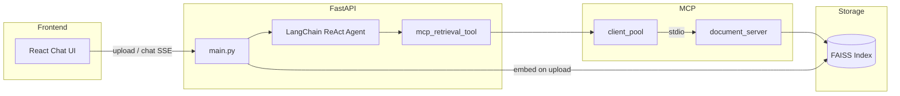

# MCP Document Assistant

An agentic full-stack application that lets you upload a PDF and ask questions about it. A LangChain ReAct agent powered by Groq decides when to retrieve document passages through a real [Model Context Protocol (MCP)](https://modelcontextprotocol.io) stdio server, with FAISS vector search and a React streaming chat UI.

**Stack:** LangChain · FastAPI · React · MCP · FAISS · Groq · Gemini Embeddings

---

## Highlights

- **Real MCP integration** — retrieval runs in a separate MCP subprocess (`document_search` tool), not an in-process mock
- **Agentic RAG** — the LLM autonomously chooses when to search the document vs. answer from chat memory
- **Session-scoped indexing** — each upload gets its own FAISS index and MCP client
- **Streaming UI** — Server-Sent Events (SSE) for token-by-token responses
- **Quantitative evaluation** — built-in benchmark script for accuracy and latency ([results](#benchmark-results))

---

## Benchmark Results

Full end-to-end evaluation on a synthetic PDF with 5 ground-truth Q&A tests (`python evaluate_chatbot.py`):

| Metric | Result |
|--------|--------|
| Answer accuracy | **100%** (5/5 passed) |
| Upload latency | **3.27 s** |
| Avg chat latency | **2.15 s** |
| Fastest response | **1.18 s** |
| Slowest response | **4.92 s** |

Retrieval-only benchmark (MCP + FAISS, no LLM):

| Metric | Result |
|--------|--------|
| MCP retrieval accuracy | **100%** (5/5) |
| Avg retrieval latency | **0.56 s** |

See [`docs/benchmarks.json`](docs/benchmarks.json) for the full recorded run.

---

## Architecture



**Request flow**

1. User uploads a PDF → FastAPI chunks text, embeds with Gemini, saves a FAISS index.
2. An MCP stdio server is linked to that session.
3. User asks a question → Groq agent may call `document_search`.
4. MCP server runs similarity search (top 4 chunks) and returns passages.
5. Agent synthesizes an answer → streamed to the React UI.

---

## Project Structure

```
mcp_chatbot/
├── main.py                      # FastAPI app (upload, chat, SSE stream)
├── evaluate_chatbot.py          # Accuracy & latency benchmark
├── requirements.txt
├── .env.example
├── docs/
│   └── benchmarks.json          # Recorded evaluation scores
├── backend/
│   ├── config.py                # API key & model settings
│   ├── rag_pipeline.py          # PDF → chunks → FAISS
│   ├── mcp/
│   │   ├── document_server.py   # MCP server (document_search tool)
│   │   └── client_pool.py       # MCP stdio client per session
│   └── tools/
│       ├── agent.py             # LangChain ReAct agent + memory
│       └── mcp_retrieval_tool.py# LangChain ↔ MCP bridge
└── frontend/
    └── src/
        ├── App.tsx              # Chat UI
        └── api.ts               # Upload, SSE streaming, session API
```

---

## Tech Stack

| Layer | Technology |
|-------|------------|
| API | FastAPI, Uvicorn |
| Frontend | React 19, TypeScript, Vite |
| Agent | LangChain ReAct + conversation memory |
| Chat LLM | Groq (`llama-3.3-70b-versatile` by default) |
| Embeddings | Google Gemini (`gemini-embedding-2-preview`) |
| Vector store | FAISS (session-scoped, on disk) |
| Protocol | MCP stdio (`mcp` Python SDK) |

---

## MCP Tools

| Tool | Description |
|------|-------------|
| `document_search(query: str)` | Semantic search over the uploaded PDF; returns up to 4 relevant text chunks |

The MCP server runs as `python -m backend.mcp.document_server` with `SESSION_ID` set per upload session.

---

## Setup

**Requirements:** Python 3.10+ (3.13 tested on Windows), Node.js 18+

### 1. Clone and install backend

```bash
git clone https://github.com/YOUR_USERNAME/mcp_chatbot.git
cd mcp_chatbot

python -m venv .venv
# Windows
.venv\Scripts\activate
# macOS / Linux
source .venv/bin/activate

pip install -r requirements.txt
```

### 2. Configure API keys

```bash
copy .env.example .env   # Windows
# cp .env.example .env   # macOS / Linux
```

Edit `.env`:

| Variable | Purpose | Get key |
|----------|---------|---------|
| `GOOGLE_API_KEY` | PDF embeddings (indexing) | [Google AI Studio](https://aistudio.google.com/apikey) |
| `GROQ_API_KEY` | Chat agent | [Groq Console](https://console.groq.com/keys) |

Optional:

```env
GROQ_CHAT_MODEL=llama-3.1-8b-instant   # higher free-tier limits
GROQ_CHAT_MAX_RETRIES=1
```

### 3. Install frontend (development)

```bash
cd frontend
npm install
cd ..
```

---

## Running Locally

### Development (two terminals)

**Terminal 1 — API**

```bash
.venv\Scripts\activate        # or source .venv/bin/activate
python main.py
```

API: [http://127.0.0.1:8000](http://127.0.0.1:8000) · Docs: [http://127.0.0.1:8000/docs](http://127.0.0.1:8000/docs)

**Terminal 2 — React dev server**

```bash
cd frontend
npm run dev
```

UI: [http://127.0.0.1:5173](http://127.0.0.1:5173)

### Production (single server)

Build the frontend, then FastAPI serves the static bundle:

```bash
cd frontend && npm run build && cd ..
python main.py
```

Open [http://127.0.0.1:8000](http://127.0.0.1:8000) — API and UI on one port.

> **Important:** Always use the project virtualenv (`.venv\Scripts\python.exe`), not system Python, so the `mcp` package is available.

---

## API Reference

| Method | Path | Description |
|--------|------|-------------|
| `GET` | `/health` | Liveness check |
| `POST` | `/upload` | Multipart PDF upload → `{ session_id }` |
| `POST` | `/chat` | JSON `{ session_id, message }` → `{ response }` |
| `POST` | `/chat/stream` | Same body; SSE stream of `{ token }` chunks |
| `DELETE` | `/session/{session_id}` | Remove agent + MCP subprocess |

Sessions are in-memory and reset on server restart. FAISS indexes persist under `vector_store/` until deleted.

---

## Evaluation

With the API running:

```bash
# Full agent Q&A (accuracy + chat latency)
python evaluate_chatbot.py

# MCP retrieval only (no Groq calls, faster)
python evaluate_chatbot.py --retrieval-only
```

The script generates a synthetic PDF with known facts, runs 5 tests, and checks answers against expected keywords. Results are saved to `eval_results.json` (gitignored).

---

## Deployment Notes

This repo is ready to push to GitHub. Do **not** commit `.env`, `.venv/`, `vector_store/`, or `frontend/node_modules/`.

**Typical deploy flow**

1. Set `GOOGLE_API_KEY` and `GROQ_API_KEY` as environment variables on your host.
2. Build frontend: `cd frontend && npm ci && npm run build`.
3. Start API: `uvicorn main:app --host 0.0.0.0 --port $PORT` (or `python main.py` locally).
4. FastAPI serves `frontend/dist` when the build folder exists.

**Platform tips**

- **Render / Railway / Fly.io** — single web service, add env vars, build step for frontend.
- **Cold start** — first MCP `document_search` call can take up to ~3 minutes while FAISS loads in the subprocess; subsequent calls are much faster.

---

## Troubleshooting

| Issue | Fix |
|-------|-----|
| `ModuleNotFoundError: No module named 'mcp'` | Activate `.venv` or use `.venv\Scripts\python.exe` |
| Groq 429 rate limit | Set `GROQ_CHAT_MODEL=llama-3.1-8b-instant`, wait, or start a new session |
| OpenMP error on Windows (`libiomp5md`) | `main.py` sets `KMP_DUPLICATE_LIB_OK=TRUE`; restart the shell if needed |
| Empty PDF / scan | Only text-based PDFs work; scanned images need OCR first |

---

## License

Free to use for learning and portfolio purposes.
